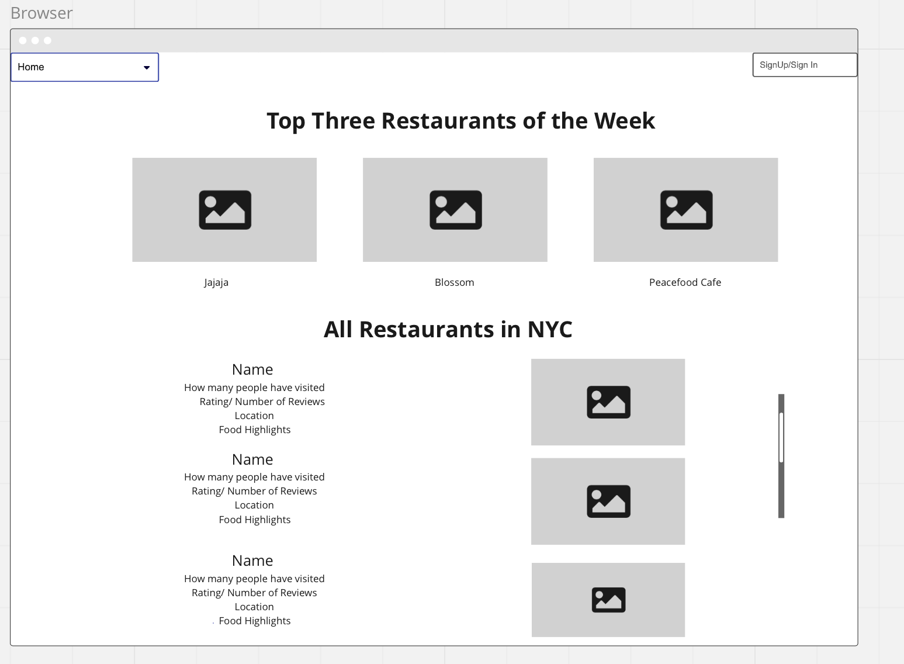
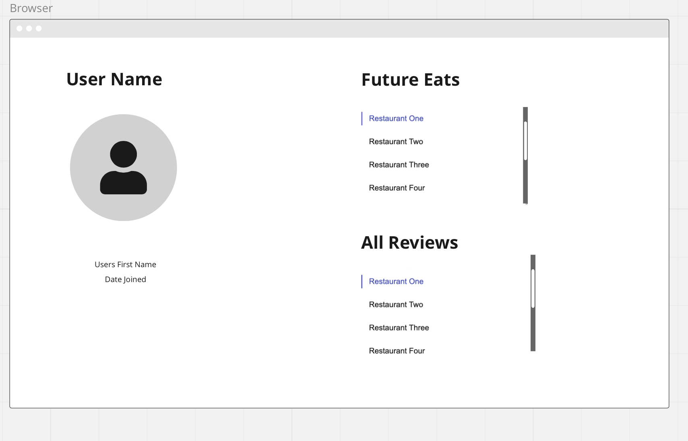
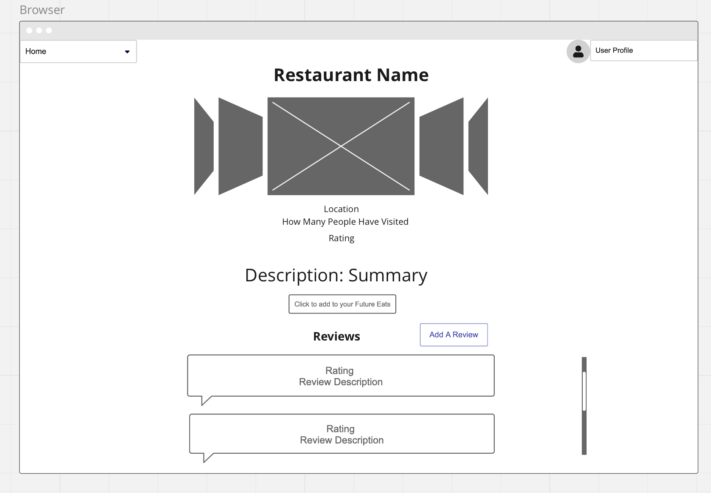
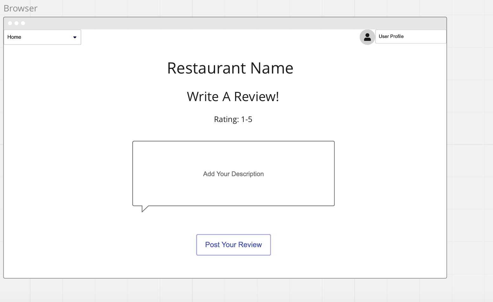
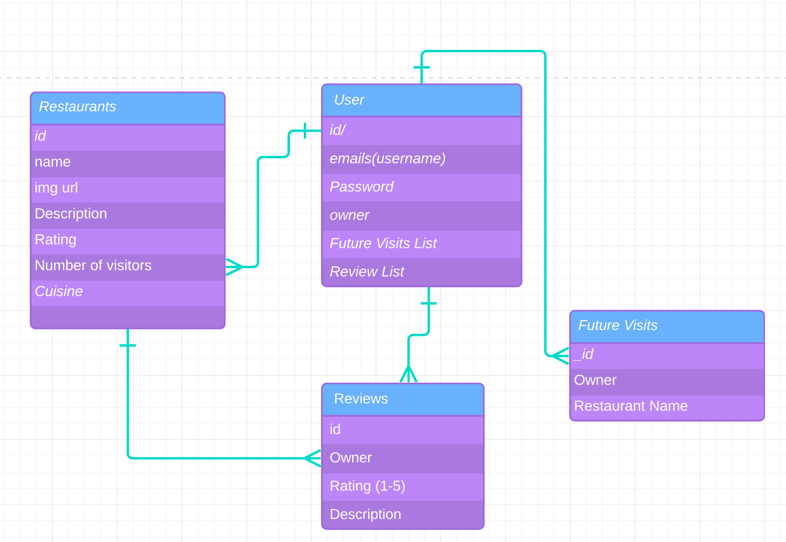

# Capstoneproject

## Vegan Restaurants in NYC 

*Share and Review Vegan Restaurants in the City with Fellow Foodies*
### A Vegan Yelp 

#### User Stories

1. The User will arrive on an index page that features 5 Recommended Restaurants of the Week as the main focus of the page, followed by a full index of vegan restauraunts in the city with ratings, and how many people have eaten there.
2. There will be a navigation bar that will have a sign in bar at the top and once signed in, a user profile and an add a restaurant review tab.
3. The user profile will feature a date joined, and two sections. One will be places that they have either saved as want to try or their reviews if any. 
4. The user can view the restaurants and reviews however they can not add them to a list or make a review without being logged in.
5. When you click on a restaurant, you will see a main image and the ability to click through all of the images in a carousel. There will be a description, a rating and how many people have eaten there. There will be a rating as well that will be the average of all the reviews. 
6. The reviews will be listed at the bottom of the page with the appropriate date attached and rating. 

Technologies Used: React, Bootstrap, JavaScript, MongoDB, Mongoose, JavaScript, Postman, Express, BCrypt, Passport

MVP: Full CRUD, along with a Fully Functioning Review System 

Stretch Goals: Recommended Restauarants Specific To Users. Adding in A Calendar for Vegan Events
Extreme Stretch: Implement a utility where you can enter a zipcode and it will find the nearest restaurants within a mile. Add Menus

WireFrames:

ERDS

